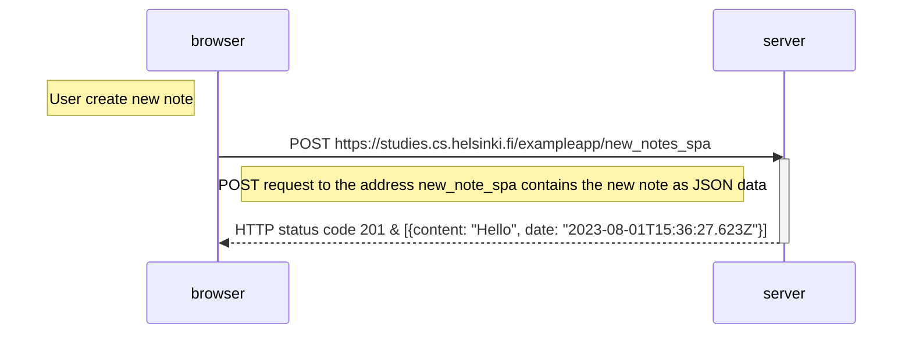

```mermaid
sequenceDiagram

participant browser
participant server

Note left of browser: User create new note

browser->>server: POST https://studies.cs.helsinki.fi/exampleapp/new_notes_spa
activate server
Note right of browser: POST request to the address new_note_spa contains the new note as JSON data
server-->>browser: HTTP status code 201 & [{content: "Hello", date: "2023-08-01T15:36:27.623Z"}]
deactivate server


```
